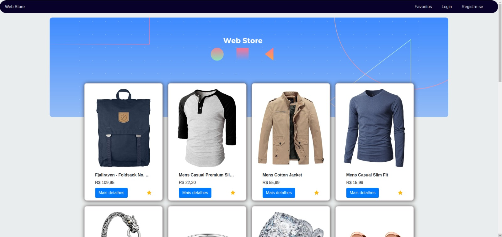

# Web Store

### Descrição

O projeto consiste em uma aplicação fullstack onde o banco de dados escolhido foi o PostgreSQL e a conexão com o banco de dados foi feita via `docker compose`. O back-end foi desenvolvido em `Node.js` e o front-end foi desenvolvido em `React.js`.

---

### Lista de tecnologias

- Node.js (back-end)
- React.js (front-end)
- Docker e Docker Compose (imagem do banco de dados)
- PostgreSQL (banco de dados)

---

### Habilidades utilizadas

- Deenvolver uma API que gerencie tanto o cadastro de usuários quanto os itens favoritados.
- Criar uma aplicação web utilizando React.js;
- Integrar o front-end com duas APIs, sendo uma de terceiros (responsável pelos produtos) e outra própria mencionada anteriormente.

---

### Como rodar o projeto

Para rodar esse projeto é necessário ter o `Node.js`, `docker` e `docker compose`.
Obs.: Os comandos abaixo devem ser executados no terminal do seu computador.

1. Clone o repositório

- `git clone https://github.com/Murilo-Carrijo/web-store.git`
- Entre na pasta do repositório que você acabou de clonar:
  `cd web-store`

2. Instale as dependências e inicialize o projeto

- Inicie a instalação pelo back-end:
  `cd back-end && npm install && cd ..`
- Em seguida, instale as dependências do front-end:
  `cd front-end && npm install && cd ..`

3. Rodando o projeto

- Pré requisitos para rodar o projeto:

  - A maquina que irá rodar essa aplicação deve ter instalado o `Docker, Docker Compose e Node.js`
  - Para que os comandos abaixo funcionem é necessaŕio que sejam executados em um terminal `bash`
  - Para facilitar o processo de colocar o projeto para roda o arquivo `.env` não foi ocultado.

- O primeiro passo é subir o banco de dados e o back-end. O comando abaixo realiza esses dois procedimentos:
  `cd back-end && npm run dev`. Caso já esteja dentro da pasta back-end, basta executar `npm run dev`.

- O próximo passo é criar as tabelas dentro do banco de dados. Para isso, abra um novo terminal, verifique em qual diretório você está e:
  Caso esteja no diretório back-end, execute o comando `npm run migration:up`. Caso esteja na raiz do projeto, execute `cd back-end && npm run migration:up && cd ..`.

- Vamos aproveitar o terminal que utilizamos para criar as tabelas para rodar o front-end:
  Caso o novo terminal abra dentro da pasta back-end, execute `cd front-end && npm run dev`. Caso você esteja na raiz do projeto, execute `cd front-end && npm run dev` e, caso você esteja na pasta front-end, execute `npm run dev`.

- Após os passos acima, o seu navegador padrão deverá abrir uma nova página no endereço `http://localhost:5173/`.



---

### Estrutura do projeto

```
├──back-end
│ ├── src                            (Diretório principal do código-fonte do projeto)
│ │   ├── controller                 (Responsável por lidar com a lógica de entrada e saída, conectando os dados às visualizações)
│ │   ├── infra                      (Contém configurações e implementações de infraestrutura, como conexões com banco de dados e provedores externos)
│ │   ├── middleware                 (Funções intermediárias que processam requisições antes de serem atendidas pelos controladores)
│ │   ├── models                     (Definições de estrutura e regras dos dados, representando as entidades do sistema)
│ │   ├── services                   (Camada de serviços que contém a lógica de negócio e interações com os modelos)
│ │   ├── tests                      (Scripts e casos de teste para garantir a qualidade e funcionamento correto do código)
│ ├── README.md                      (Arquivo de documentação com informações sobre o projeto e como utilizá-lo)
│ └── ...                            (Outros arquivos e diretórios de configuração do projeto)
├──front-end
│ ├── src                            (Diretório principal dos arquivos do projeto)
│ │   ├── assets                     (Recursos de folhas de estilo, scripts, fontes e imagens)
│ │   ├── components                 (Componentes que são utilizados nas como elementos das páginas)
│ │   ├── pages                      (Paginas da aplicação)
│ │   ├── service                    (Utilizado para transferir dados através de protocolos de comunicação para diferentes plataformas)
│ │   ├── utils                      (Scripts javascript utilizados de forma auxiliar dentro da aplicação)
│ ├── README.md                      (Arquivo de documentação com informações sobre o projeto e como utilizá-lo)
│ └── ...                            (Outros arquivos e diretórios de configuração do projeto)
├── README.md                        (Arquivo de documentação com informações sobre o projeto e como utilizá-lo)
└── ...                              (Outros arquivos e diretórios de configuração do projeto)
```

---

### Testes

Devido ao tempo e às priorizações, optei por criar testes de integração para o back-end. O front-end, por ser mais visual, foi testado manualmente durante o desenvolvimento.

#### Como rodar os testes do back-end

Execute o comando `npm run test` ou `npm run test:watch` dentro do diretório back-end e os testes serão executados.
